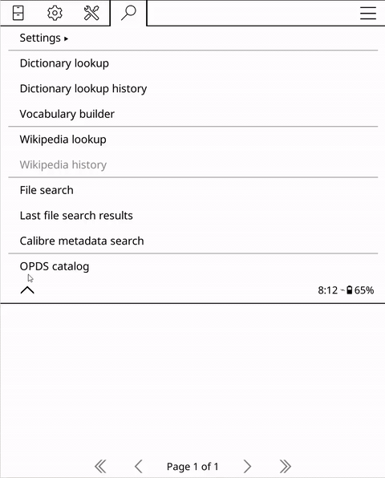

# [Later.ink](https://later.ink)

**Your Readwise Reader queue, on your e-reader.**

<p align="center">
  
</p>

Later.Ink is a small server that turns your [Readwise Reader](https://readwise.io/read)
account into an [OPDS catalog](https://opds.io/). Point KOReader — or any ebook
reader that speaks OPDS, including on iPhone and iPad (Fablum, justRead,
PocketBook), Android (Moon+ Reader), or desktop (Thorium Reader) — at one URL
and browse your saved articles,
downloading any of them as a clean EPUB, generated on the fly from the article HTML
that Reader has already cleaned up.

No plugin, no sync daemon, and nothing to install from us — ebook readers already
speak OPDS.

**Free and open source (MIT), and built to self-host** with your own Readwise
token. Run it on a NAS, a Raspberry Pi, a VPS, or your laptop — it stores nothing,
reading your queue live from Readwise.

> **Scope:** later.ink is a *reading path, not a sync path*. It never writes
> back to Readwise, so articles stay in your queue as you read them. If you want
> finished articles archived and removed from the device automatically, the
> [Endle/readwisereader](https://github.com/Endle/readwisereader) KOReader
> plugin does that — this project trades write-back for zero install and working
> on any OPDS client. (Note: Readwise already serves Kindle natively via
> send-to-Kindle; the sweet spot here is Kobo, Boox, and other non-Kindle
> e-ink.)

## Self-host quickstart

> **Upgrading from ≤0.3.x?** The internal package was renamed for the brand:
> `read_later_opds` is now `later_ink`. Docker users just rebuild
> (`docker compose up -d --build --remove-orphans` — the flag retires the
> container from the old `opds` service name). If you run without Docker,
> reinstall (`pip install -e .`) and use the new module path:
> `python -m uvicorn later_ink.main:app ...`. Your `.env` and database are
> untouched. One cosmetic side effect: EPUB identifiers changed with the
> rename, so a re-downloaded article registers as a new book in your
> reader's library rather than an update to the old copy.

**Prebuilt image** (fastest — no checkout; amd64 & arm64, Pi included):

```bash
docker run -d --name later-ink -p 8000:8000 \
  -e READWISE_TOKEN=your_token_from_readwise.io/access_token \
  -e DATABASE_PATH=/data/app.db -v later-ink-data:/data \
  --restart unless-stopped \
  ghcr.io/brendanlefebvre/later-ink:latest
```

(Or pin a version tag, e.g. `:0.4.1`. Add `-e WALLABAG_*=...` vars
to serve Wallabag too — see [.env.example](.env.example) for the full list.
The same image drops straight into a Compose file or Portainer stack.)

**With Docker Compose, from source:**

```bash
git clone https://github.com/brendanlefebvre/later-ink.git
cd later-ink
mkdir -p ~/.config/later-ink && cp .env.example ~/.config/later-ink/env
# edit that file: READWISE_TOKEN=<your token from https://readwise.io/access_token>
docker compose up -d
```

**Without Docker** (Python 3.11+):

```bash
pip install later-ink
READWISE_TOKEN=your_token python -m uvicorn later_ink.main:app --host 0.0.0.0 --port 8000
```

Or from a source checkout:

```bash
git clone https://github.com/brendanlefebvre/later-ink.git
cd later-ink
python -m venv .venv && . .venv/bin/activate   # Windows: .venv\Scripts\activate
pip install .
mkdir -p ~/.config/later-ink && cp .env.example ~/.config/later-ink/env
# edit that file: READWISE_TOKEN=<your token from https://readwise.io/access_token>
python -m uvicorn later_ink.main:app --host 0.0.0.0 --port 8000
```

Config is read from `$XDG_CONFIG_HOME/later-ink/env` (default
`~/.config/later-ink/env`), falling back to `./.env`; variables already set in
the real environment always take precedence.

Your catalog is now at `http://your-host:8000/opds/`.

**KOReader setup:** top menu → magnifying glass → *OPDS catalog* → `+` → enter
the URL. Browse folders (Later, New, Shortlist, Archive, Feed), tap an article
to download and read. Images are embedded in the EPUB, so articles read fully
offline. Use KOReader's OPDS search box to find articles by title, author, or
summary; search scans your most recent saved items (a bounded slice of a very
large queue) rather than the entire history.

**On iPhone/iPad:** use an ebook reader that supports OPDS — Fablum, justRead, or
PocketBook — and add the same catalog URL. **On desktop:** Thorium Reader works too.

**What appears:** articles, newsletters, PDFs, books (uploaded EPUBs), video
transcripts, tweet threads, and podcasts — each delivered as an EPUB, converted
from the content Readwise exposes. Multi-section books and long articles are split
into chapters with a navigable table of contents, and every EPUB opens on a
generated cover. A podcast converts only after you've loaded its transcript in
Readwise Reader (until then the API returns a stub, and the download reports
that). Configurable via `READWISE_CATEGORIES` (e.g. `article,pdf`).

## Hosted version

There's no public hosted instance running yet — self-hosting is the supported
path today. The server does include an optional multi-tenant mode (short,
e-ink-typeable catalog URLs like `later.ink/maple-crater-lantern-owl/`, with per-user
tokens encrypted at rest), so a free hosted instance may come later. If you want
to stand one up yourself, see the multi-tenant env vars in `.env.example`.

## Architecture

```
src/later_ink/
  main.py          # FastAPI routes: OPDS feeds, EPUB downloads, onboarding
  config.py        # env-var configuration
  opds.py          # OPDS 1.x Atom feed builder
  epub.py          # HTML → EPUB (ebooklib + lxml cleanup)
  covers.py        # generated EPUB covers (hero image + typographic fallback)
  store.py         # SQLite user store + word-based secret URLs
  words.py         # wordlist behind the secret URLs (e-ink-typeable words)
  ratelimit.py     # per-IP throttle for unknown-secret probes
  pages.py         # server-rendered HTML pages
  payments.py      # Stripe verification (optional; inactive unless configured)
  connectors/
    base.py        # Connector interface: folders / articles / article HTML
    readwise.py    # Readwise Reader API v3 connector
    wallabag.py    # Wallabag API v2 connector (OAuth2)
```

Readwise and [Wallabag](https://wallabag.org/) are supported today (set the
`WALLABAG_*` vars in `.env.example` to enable Wallabag). More connectors
(Instapaper) are planned — the connector interface is three methods.

## Development

```bash
pip install -e ".[dev]"
ALLOW_FREE_SIGNUP=1 python -m uvicorn later_ink.main:app --reload
pytest
```

## Credits

Generated EPUB covers use [League Spartan](https://github.com/theleagueof/league-spartan)
by The League of Moveable Type, bundled under the SIL Open Font License
(`src/later_ink/assets/fonts/OFL.txt`).

## License

MIT
